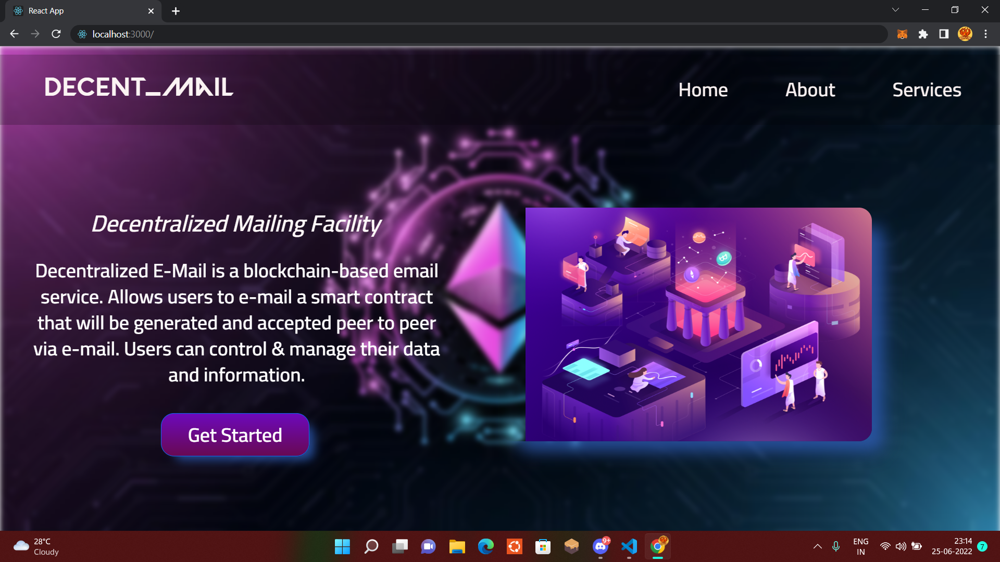

# Hacking-Heist-2.0__Decent_mail ✉️

 <h5> Decentralized E-Mail is a blockchain-based email service. Allows users to e-mail a smart contract that will be generated and accepted peer to peer via e-mail. Users can control & manage their data and information.</h5>
  
  

### Built Using :
   
   - React
- Bootstrap
- CSS

- Chai
- Ethereum-waffle
- Ethers
- hardhat
- Polygon
- Solidity
  
  
### Developed by

[Irshit Mukherjee](https://github.com/IRSHIT033)

[Priyanka Kothari](https://github.com/priyanka001tech)

[Rwitesh Bera](https://github.com/rwiteshbera)

[Archisman Saha](https://github.com/archismansaha)
